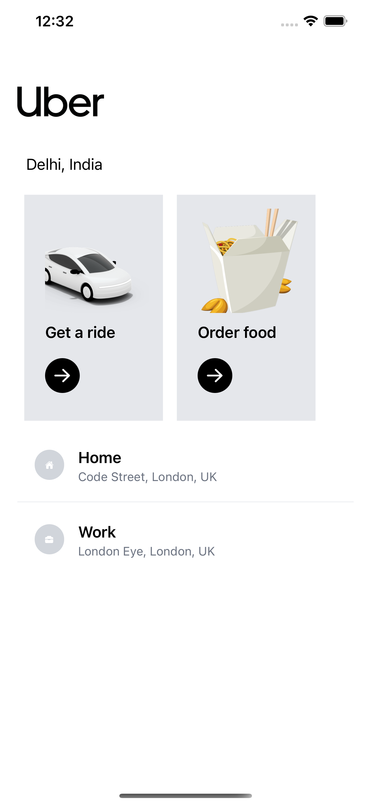
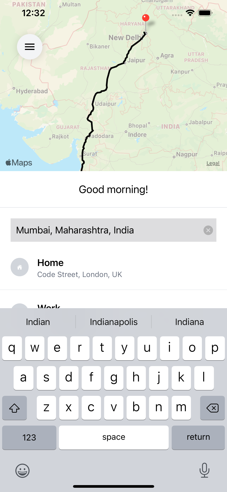
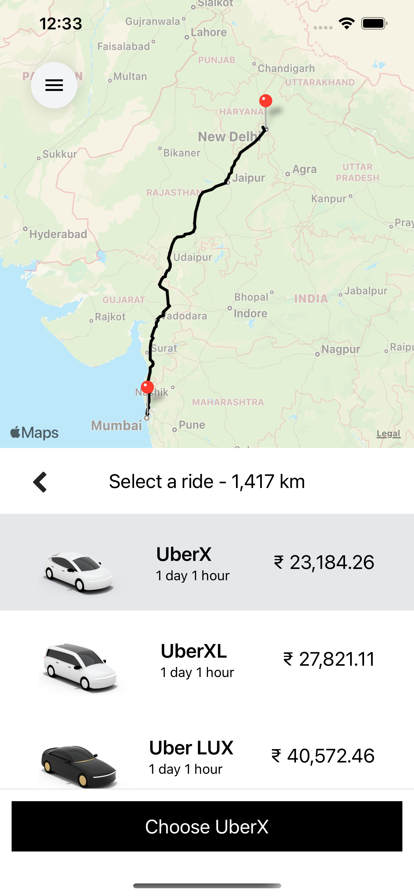

# Uber Clone #

This is a clone of the Uber cab booking app. It allows the user to enter the source, destination and then displays the shortest route and a price for the ride based on the distance using Google APIs.

| |  | |
|-|-|-|

## Technologies used ##
* React Native - To develop the app
* Tailwind CSS - For styling
* Google Maps APIs - To calculate travel time, distance, and directions
    * Directions API
    * Places API
    * Distance Matrix API
* Redux - As state container
* Expo - To build and test the app

## Directions to run ##
Clone the repository and run `npm install` from inside the repository to fetch all the dependencies. Create a `.env` file with an entry `GOOGLE_MAPS_APIKEY=<your-api-key>` where `<your-api-key>` is your Google Maps API access token. Use `expo start` to start the app. 